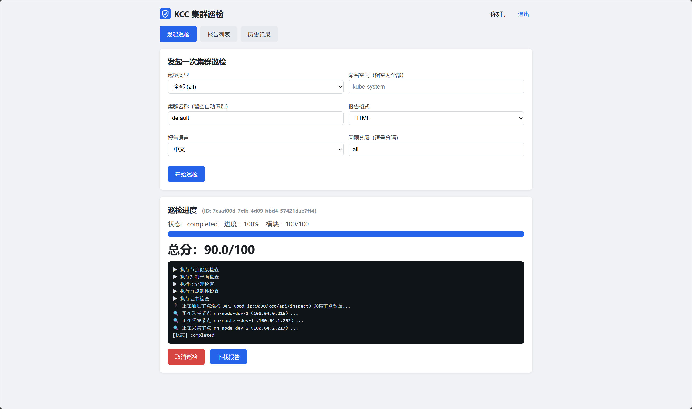
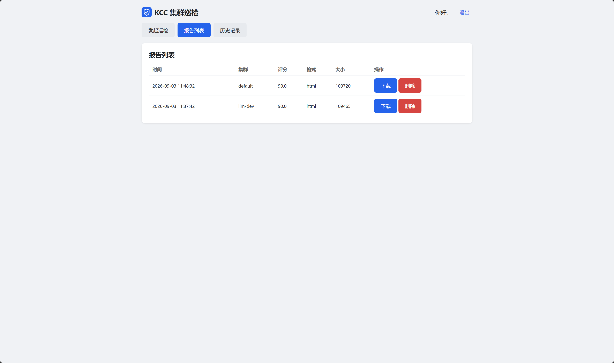
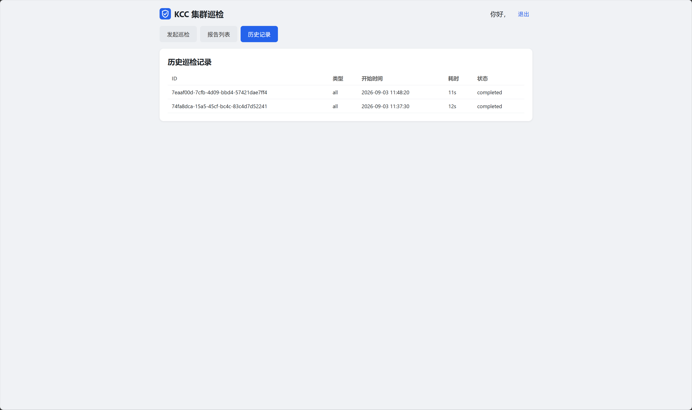
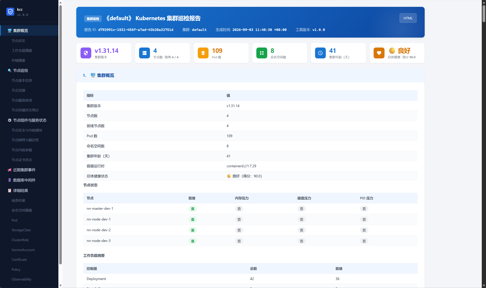
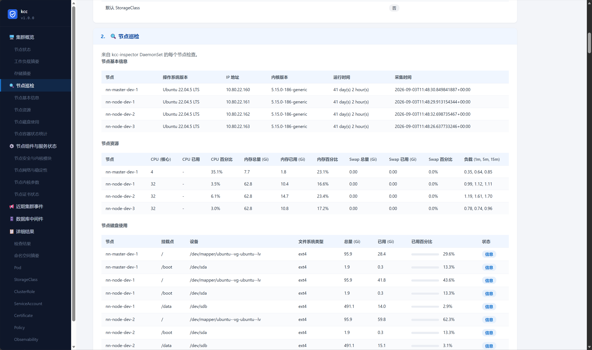

<div align="center">
  
</div>

# KCC - Kubernetes Cluster Inspector

> 🔍 一个用 Rust 编写的 Kubernetes 集群巡检工具

## 📖 简介

KCC（Kubernetes Cluster Inspector）面向平台 / SRE 团队，用于评估 Kubernetes 集群的健康状况、安全基线与资源效率。它包含**命令行工具、HTTP API 与 Web 前端**三条使用路径。

## ✨ 功能

- **🔍 全面巡检**：节点、Pod、网络、存储、安全、资源、控制面、弹性伸缩、批处理/定时任务、策略、可观测性、升级就绪、证书等 **14 个巡检模块**。
- **📊 智能评分**：加权评分，突出薄弱环节。
- **📋 报告输出**：支持 Markdown / JSON / CSV / HTML 四种格式，支持中英文。
- **🖥️ Web 前端**：账号密码登录，网页触发巡检、实时查看进度与日志、下载报告。
- **🔌 HTTP API**：主程序提供 `/kcc/api/*` 接口，节点巡检器提供 `/kcc/api/inspect|health|status`。
- **⚡ 高性能**：异步 Rust 实现。

## 🏗️ 架构

```
kcc/
├── src/
│   ├── main.rs             # 二进制入口（check / server / node-inspector 三子命令）
│   ├── lib.rs              # 库入口
│   ├── config.rs           # 集中配置
│   ├── cli/                # CLI 解析
│   ├── k8s/                # Kubernetes 客户端封装
│   ├── inspections/        # 巡检模块与调度器
│   ├── scoring/            # 评分引擎
│   ├── reporting/          # 报告生成与报告索引
│   ├── node_inspection/    # 节点本机采集（local）与 HTTP 采集（http）
│   ├── jobs/               # 任务模型、日志缓冲、进度事件、历史
│   └── server/             # HTTP 服务端（auth / main_api / node_api / statics）
├── web/                    # Web 前端源码（内嵌进二进制）
├── deploy/                 # Kubernetes 部署清单和 Dockerfile
└── tests/                  # 集成测试
```

### 预览











## 🚀 快速开始

### 构建

```bash
# Debian/Ubuntu 需要 musl-gcc（编译 vendored OpenSSL 用）
apt-get install -y musl-tools

# amd64 构建
rustup target add x86_64-unknown-linux-musl
cargo build --release --target x86_64-unknown-linux-musl

# arm64 构建
rustup target add aarch64-unknown-linux-musl
cargo build --release --target aarch64-unknown-linux-musl

# docker 构建
docker build -t kcc:latest -f deploy/Dockerfile .

# 如果使用 glibc
cargo build --release
```

### 测试

```bash
cargo test
```

### 三个子命令

| 子命令 | 说明 |
|--------|------|
| `kcc check` | 命令行一键巡检，输出报告 |
| `kcc server` | 启动主程序 HTTP 服务 + Web（默认端口 5005） |
| `kcc node-inspector` | 启动节点巡检守卫（默认端口 9090），供 DaemonSet 使用 |

### CLI 巡检

```bash
# 参数模式
kcc check \
  # 指定 kubernetes config（kubeconfig）
  --kubeconfig ~/.kube/config \
  # 指定巡检的命名空间
  -n kube-system \
  # 指定输出文件 / 格式
  -o report.html -f html \
  # 指定报告中显示的集群名称
  --cluster-name lim-dev \
  # 指定语言
  --lang zh \
  # 问题分级
  --level warning,critical \
  # 指定节点采集器所在的命名空间
  --node-inspector-namespace kube-system \
  # 节点采集方式与端口
  --node-access-mode pod-ip --node-inspector-port 9090

# 配置文件模式
kcc check --config-file kcc.yaml
```

节点采集：连接集群 →（默认）经节点巡检 API 采集各节点数据 → 跑 14 个巡检模块 → 生成报告文件。

| 模式 | 说明 |
|------|------|
| `pod_ip`（默认） | 主程序直接访问每个节点巡检 Pod 的 IP，调用 `http://<podIP>:9090/kcc/api/inspect` |
| `cluster_ip_service` | 预留（通过 Service 访问，未实现） |


### Web 巡检

启动主程序服务：

```bash
# 参数模式
kcc server \
  # 指定监听地址:端口 / base路径
  --addr 0.0.0.0:5005 --web-base /kcc \
  # 指定 kubernetes config（kubeconfig）
  --kubeconfig ~/.kube/config \
  # 节点采集方式与端口
  --node-access-mode pod-ip --node-inspector-port 9090

# 配置文件模式
kcc server --config-file kcc.yaml
```

启动 `kcc server` 后访问 `http://<host>:5005/kcc/`，用管理员账号登录，即可通过网页触发巡检、实时查看进度与日志、下载报告。首次启动会输出初始化管理员账号的信息。

默认账号：`admin / admin`（首次使用请修改，或用环境变量 `KCC_ADMIN_PASSWORD` 指定默认密码启动）。

功能：
1. **登录**（账号密码，JWT）。
2. **发起巡检**：选择巡检类型、命名空间、报告格式与语言 → 点击「开始巡检」。
3. **实时进度**：SSE + 轮询展示每模块进度与日志；可「取消巡检」。
4. **报告下载**：完成后生成报告，可在进度页或「报告列表」下载 md/json/csv/html。
5. **历史记录**：每次巡检的执行记录（logs/runs/*.md）。

#### nginx 路径代理

`web_base` 默认为 `/kcc`，nginx 直接代理该前缀即可：

```nginx
location /kcc/ {
    proxy_pass http://127.0.0.1:5005;   # 保留 /kcc 前缀；如需去掉请配 strip_prefix
    proxy_http_version 1.1;
    proxy_set_header Host $host;
    proxy_buffering off;                 # 以便 SSE 实时推送
}
```
如需改用其它前缀（如 `/insp`），以 `--web-base /insp` 启动即可。

#### Kubernetes 部署
```bash
kubectl apply -f deploy/kcc-server/deployment.yaml
```

### 节点巡检

在集群节点上以 DaemonSet 方式部署节点巡检守卫（Rust 守护进程，与主程序同一二进制，子命令 `node-inspector`，默认端口 9090），主程序通过 Pod IP 调用其 `:9090` API 采集节点数据，不再需要重启容器或轮询日志：

- 命名空间默认 `kube-system`；DaemonSet 名称 `kcc-inspector`，label `app=kcc-inspector`。
- 使用 kcc **复用镜像** `kcc:latest`并用 `command: ["kcc", "node-inspector"]` 覆盖。
- 每个节点以 `kcc node-inspector` 守护运行，暴露 9090 的 `/kcc/api/health`、`/kcc/api/inspect`。
- 主程序通过 pod-ip 访问它，两者需同一集群、NetworkPolicy 允许。

```bash
# CLI 启动
kcc node-inspector --addr 0.0.0.0:9090
```

#### Kubernetes 部署

```bash
kubectl apply -f deploy/kcc-inspector/daemonset.yaml
```

### 环境变量列表

| 环境变量 | 用途 | 默认值 |
|----------|------|--------|
| `KCC_SERVER_ADDR` | HTTP + Web 监听地址 | `0.0.0.0:5005` |
| `KCC_WEB_BASE` | Web / API 前缀 | `/kcc` |
| `KCC_INSPECTOR_NAMESPACE` | 节点巡检 DaemonSet 命名空间 | `kube-system` |
| `KCC_INSPECTOR_LABEL` | 节点巡检 Pod 选择标签 | `app=kcc-inspector` |
| `KCC_NODE_ACCESS_PORT` | 节点巡检程序端口 | `9090` |
| `KCC_NODE_ACCESS_MODE` | 节点采集方式：`pod_ip`、`cluster_ip_service` | `pod_ip` |
| `KCC_REPORTS_DIR` | 报告输出目录 | `./reports` |
| `KCC_LOGS_DIR` | 执行记录 / 日志目录 | `./logs` |
| `KCC_DEFAULT_FORMAT` | 默认报告格式：`md`、`json`、`csv`、`html` | `html` |
| `KCC_DEFAULT_LANG` | 默认报告语言：`zh`、`en` | `zh` |
| `KCC_DEFAULT_LEVEL` | 默认问题分级：`all`、`info,warning,critical` | `warning,critical` |
| `KCC_KUBECONFIG` | kubeconfig 路径 | — |
| `KCC_AUTH_ENABLED` | 认证开关：`true`、`false` | `true` |
| `KCC_AUTH_SECRET` | JWT 签名密钥（仅无配置文件时） | `change-me-kcc-super-secret` |
| `KCC_ADMIN_USER` | 默认管理员用户名（仅无配置文件时） | `admin` |
| `KCC_ADMIN_PASSWORD` | 默认管理员密码（仅无配置文件时） | `admin` |
| `KCC_NODE_INSPECTOR_ADDR` | 节点巡检程序监听地址 | `0.0.0.0:9090` |
| `KCC_HOST_ROOT` | 宿主机根目录挂载点 | `/host` |
| `NODE_NAME` | 本节点名称 | 自动推断 |

> 优先级：**参数 > 环境变量 > 配置文件 > 默认值**。`KCC_AUTH_*`、`KCC_ADMIN_*` 仅在未使用配置文件时读取。
> 若指定了 `--config-file`，认证信息以配置文件 `auth` 段为准（缺失时无可用账号）。

### 配置文件

`kcc check --config-file kcc.yaml` / `kcc server --config-file kcc.yaml`。
格式为**扁平结构**（与 Config 字段一一对应），所有字段均可省略（用默认值）：

```yaml
server_addr: "0.0.0.0:5005"         # 等价 KCC_SERVER_ADDR
web_base: "/kcc"                     # 等价 KCC_WEB_BASE
node_inspector_addr: "0.0.0.0:9090"  # 等价 KCC_NODE_INSPECTOR_ADDR（node-inspector 监听）
node_host_root: "/host"              # 等价 KCC_HOST_ROOT
node_inspector_namespace: "kube-system"
node_inspector_label: "app=kcc-inspector"  # 等价 KCC_INSPECTOR_LABEL
node_access:
  mode: "pod_ip"        # pod_ip | cluster_ip_service
  port: 9090
  timeout_secs: 30       # 节点 HTTP 采集超时（秒）
reports_dir: "./reports"            # 等价 KCC_REPORTS_DIR
default_format: "html"                 # 默认报告格式：html | json | csv | html（等价 KCC_DEFAULT_FORMAT）
default_lang: "zh"                 # 默认报告语言：zh | en（等价 KCC_DEFAULT_LANG）
default_level: "warning,critical"   # 默认问题分级：all 或 info,warning,critical（等价 KCC_DEFAULT_LEVEL）
logs_dir: "./logs"                  # 等价 KCC_LOGS_DIR
kubeconfig: "/root/.kube/config"    # 可选：等价 --kubeconfig 参数 / KCC_KUBECONFIG
auth:
  enabled: true            # 认证开关；也可用环境变量 KCC_AUTH_ENABLED
  secret: "your-random-jwt-secret"   # JWT 密钥（配置文件模式下覆盖 KCC_AUTH_SECRET）
  token_ttl_secs: 28800    # token 有效期（秒）
  users:
    - username: admin
      password_hash: "$argon2id$v=19$..."   # argon2 PHC 哈希（可用 kcc 生成的哈希）
```

生成 argon2 密码哈希的示例（任意程序生成 PHC 字符串均可，如 Python）：

```python
# pip install argon2-cffi
from argon2 import PasswordHasher
print(PasswordHasher().hash("your-password"))
```

## 📈 报告

- 每次运行生成一份报告，默认名 `kubernetes-inspection-report-{时间戳}.{ext}`。支持 Markdown / JSON / CSV / HTML，默认中文。Web 端可在“报告”页浏览、预览与下载历史报告。
- 报告目录：`./reports`（含 `index.json` 索引，Web「报告列表」据此展示）。
- 执行记录：`./logs/runs/{inspect_id}.md`。

## 🔌 API

[docs/API.md](docs/API.md)。

## 📄 License

MIT